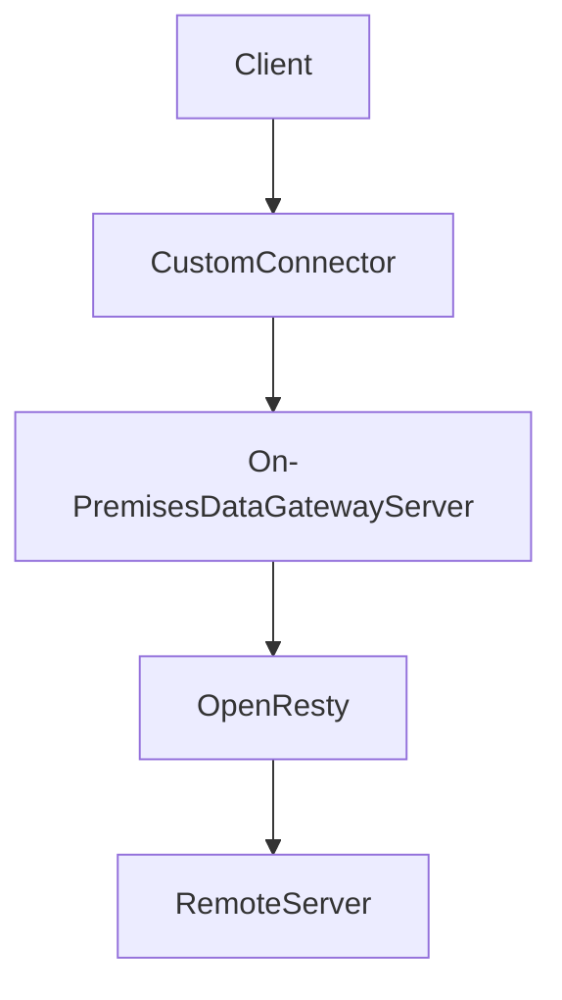

# log-http-headers-example

## Description
This is a simple example of how to log HTTP headers with On-Premises Data Gateway & OpenResty | HTTP Custom Proxy(by Rust)
***

### Related documentations
- https://openresty.org/en/
- https://openresty-reference.readthedocs.io/en/latest/Lua_Nginx_API/?msclkid=3a3751e6ae5911ec9274aad06d857d21#ngxreqget_headers
- https://docs.microsoft.com/en-us/iis/configuration/system.webserver/security/requestfiltering/requestlimits/headerlimits/
- https://httpd.apache.org/docs/2.2/mod/core.html#limitrequestfieldsize
- http://nginx.org/en/docs/http/ngx_http_core_module.html#large_client_header_buffers
- https://stackoverflow.com/questions/686217/maximum-on-http-header-values
- https://docs.microsoft.com/en-us/data-integration/gateway/service-gateway-proxy

### Flow chart

